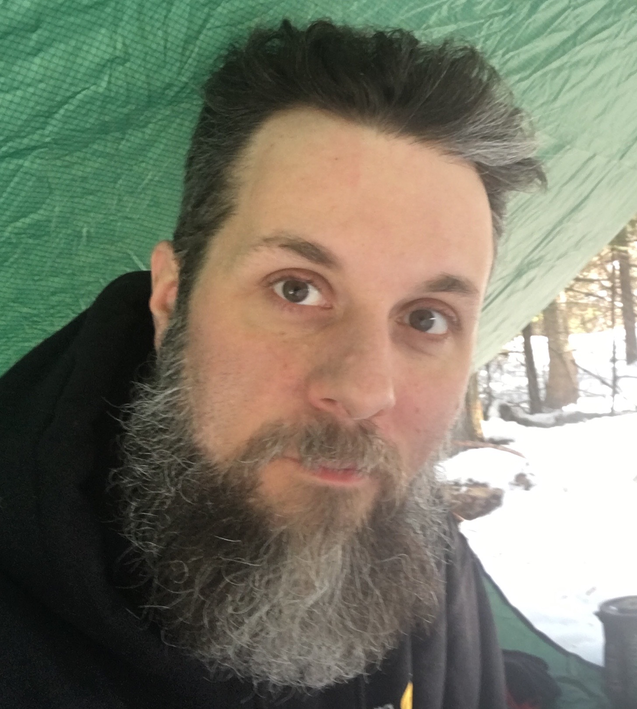

Hi there!  I'm Bill.  Nice to meet you.  I have blogged about all sorts of things in the past.  So I decided to start again.  This time in the philosophy of learn by doin.  I'm using Jekyll and Github.  Learning markdown and ruby while I am at it. Thanks for reading and keep being awesome!

<iframe width="560" height="315" src="https://www.youtube.com/embed/T0NawB8j2q0" frameborder="0" allow="accelerometer; autoplay; clipboard-write; encrypted-media; gyroscope; picture-in-picture" allowfullscreen></iframe>
